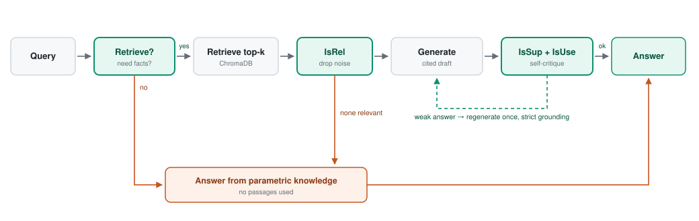
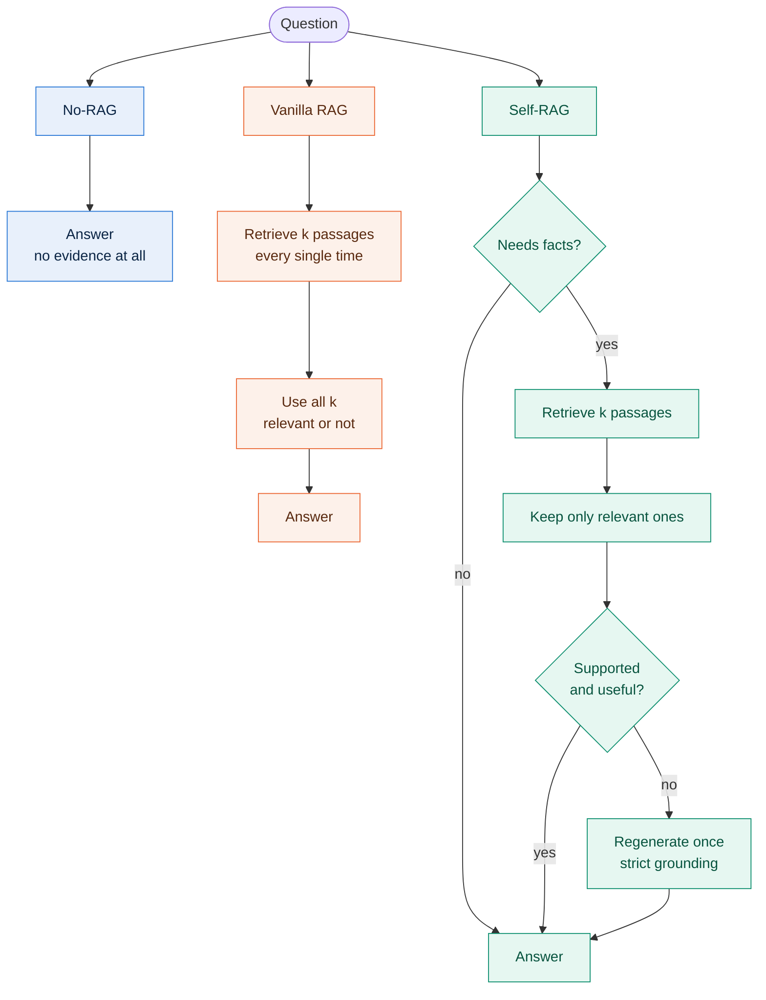
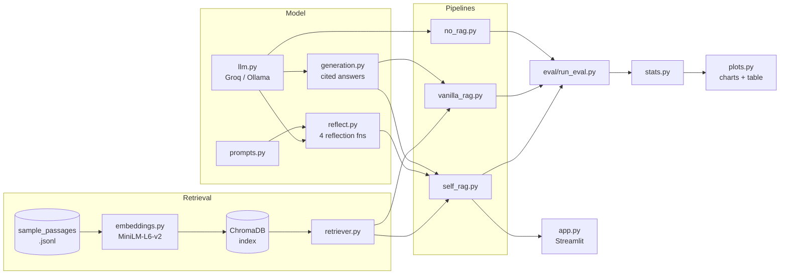

<div align="center">

# 🧠 Self-RAG

### Teaching a language model *when* to look things up — and whether to trust what it found

An inference-time reimplementation of **[Self-RAG: Learning to Retrieve, Generate, and Critique through Self-Reflection](https://arxiv.org/abs/2310.11511)** (Asai et al., ICLR 2024)

[](https://arxiv.org/abs/2310.11511)
[](https://www.python.org/)
[](https://streamlit.io/)
[](https://www.trychroma.com/)
[](https://groq.com/)


</div>

---

## The problem in one picture

Standard RAG retrieves the same fixed number of passages for **every** question — even "what is 15 + 27?" — and then uses whatever came back, relevant or not. Self-RAG turns both of those into *decisions the model makes*, shown here as the three green gates:

<div align="center">
<picture>
  <source media="(prefers-color-scheme: dark)" srcset="docs/assets/pipeline-dark.svg">
  <source media="(prefers-color-scheme: light)" srcset="docs/assets/pipeline-light.svg">
  
</picture>
</div>

> **Green = a reflection gate** (the paper's contribution). **Orange = an escape hatch** — the two paths where the system answers *without* retrieved evidence, either because it never needed it or because nothing relevant survived filtering.

---

## Contents

- [What this project does](#what-this-project-does)
- [The four reflection signals](#the-four-reflection-signals)
- [How the three systems differ](#how-the-three-systems-differ)
- [Quickstart](#quickstart)
- [The demo](#the-demo)
- [How the code fits together](#how-the-code-fits-together)
- [Evaluation](#evaluation)
- [Testing](#testing)
- [Project structure](#project-structure)
- [Troubleshooting](#troubleshooting)
- [How it was built](#how-it-was-built)

---

## What this project does

The original paper **trains** a 7B/13B model to emit special *reflection tokens*, which needs GPT-4-distilled labels and serious GPU time. That is out of reach for a semester project.

So this project reproduces the paper's **behaviour** instead of its training: each reflection token becomes a short, constrained prompt to a small instruction-tuned LLM, and the pipeline branches on the parsed answer. Everything runs on **CPU**, using **free** tools.

Three systems answer the same questions so they can be compared head to head:

| | System | Behaviour | Retrieves? |
|:--:|---|---|:--:|
| 🔵 | **No-RAG** | Answers from the model's own knowledge | never |
| 🟠 | **Vanilla RAG** | Always retrieves top-k, then answers | always |
| 🟢 | **Self-RAG** | Decides *whether* to retrieve, filters passages, critiques itself | on demand |

---

## The four reflection signals

Each of the paper's reflection tokens becomes one function that returns a parseable label:

| Paper token | Our function | The question it answers | Returns |
|---|---|---|---|
| `Retrieve` | [`needs_retrieval`](src/reflect.py) | Does this need external facts at all? | `True` / `False` |
| `IsRel` | [`is_relevant`](src/reflect.py) | Is this passage actually relevant? | `True` / `False` |
| `IsSup` | [`is_supported`](src/reflect.py) | Is the answer grounded in the passages? | `fully` / `partially` / `no` |
| `IsUse` | [`usefulness`](src/reflect.py) | Is the answer useful? | `1`–`5` |

A single model plays **both generator and critic**, matching the paper's "single arbitrary LM" framing. Every critique prompt asks for one word or one digit, which keeps parsing deterministic and cheap.

```python
def needs_retrieval(query, generate=None):
    """Retrieve token: True if the question needs external factual lookup."""
    out = generate(RETRIEVE_PROMPT.format(query=query),
                   system=RETRIEVE_SYSTEM, max_tokens=4)
    return "YES" in out.strip().upper()
```

---

## How the three systems differ

The interesting comparison isn't "does retrieval help" — it's **what each system does with the evidence**:



Two things fall out of this that the evaluation measures directly:

- Self-RAG's **retrieval rate is below 100%** — it skips retrieval when the question doesn't need it.
- Self-RAG uses **fewer passages** than it retrieves, because `IsRel` drops the noise.

---

## Quickstart

**1 — Install** (all dependencies are free and CPU-friendly)

```bash
pip install -r requirements.txt
```

**2 — Add a free API key** from [console.groq.com/keys](https://console.groq.com/keys)

```bash
cp .env.example .env
```

Then edit `.env` and set `GROQ_API_KEY=...`

**3 — Build the vector index** (downloads the ~80 MB embedding model on first run)

```bash
python data/build_index.py
```

**4 — Launch the demo**

```bash
python -m streamlit run app.py
```

<details>
<summary><b>💤 No API key? Run fully offline with Ollama</b></summary>

<br>

Install [Ollama](https://ollama.com), pull a small model, then set `LLM_BACKEND=ollama` in your `.env`:

```bash
ollama pull phi3:mini
```

The LLM wrapper in [`src/llm.py`](src/llm.py) hides the difference, so nothing else changes.

</details>

---

## The demo

The Streamlit app doesn't just print an answer — it exposes **every reflection decision the pipeline made**, which is what makes the paper's mechanism visible:

```
┌─ Answer ──────────────────────────────────────────────┐
│  Hamlet was written by William Shakespeare [1].       │
└───────────────────────────────────────────────────────┘

┌─ Reflection steps ────────────────────────────────────┐
│  1. Retrieve  →  yes — the question needs facts       │
│  2. IsRel     →  kept 2 of 5 passages (3 dropped)     │
│  3. IsSup     →  fully      4. IsUse  →  5/5          │
│  ✅ Passed both critiques — no regeneration needed     │
└───────────────────────────────────────────────────────┘

┌─ Cited sources ───────────────────────────────────────┐
│  ▸ [1] Hamlet          — similarity 0.847             │
│  ▸ [2] W. Shakespeare  — similarity 0.792             │
└───────────────────────────────────────────────────────┘
```

> ℹ️ *The layout above is a schematic of the UI, not a recorded run.* Numbers appear once you run it with your own key.

The sidebar carries the system selector, a `k` slider, live setup status (API key found? index built?), and a reference card for the four tokens.

<!-- 📸 ADD YOUR OWN SCREENSHOT HERE
     1. Run:  python -m streamlit run app.py
     2. Ask an example question so the reflection panel fills in
     3. Screenshot it, save as docs/assets/demo.png, and uncomment:


     For an animated GIF, record with ScreenToGif (Windows) or LICEcap,
     save as docs/assets/demo.gif, and embed the same way.
-->

---

## How the code fits together



Every system returns `(answer, info)` with the **same metadata keys**, so the harness and the demo read them all identically:

```python
{
  "retrieved": True,        # did the Retrieve gate fire?
  "num_retrieved": 5,       # passages fetched
  "passages_used": 2,       # passages that survived IsRel
  "support": "fully",       # IsSup verdict
  "usefulness": 5,          # IsUse rating
  "regenerated": False,     # did the strict retry run?
  "passages": [...],        # what the citations point at
}
```

---

## Evaluation

Run all three systems over the same questions, then summarise and plot:

```bash
python eval/run_eval.py
```

```bash
python eval/stats.py
```

```bash
python eval/plots.py
```

This writes `docs/RESULTS.md` plus three comparison figures. Flags: `--dataset {sample,popqa}`, `--n`, `--k`, `--systems`.

### What gets measured

| Metric | Why it matters |
|---|---|
| **Accuracy** | A gold answer appears in the output — the paper's PopQA metric, fair to free-form prose |
| **Exact match** | Strict whole-string match after normalisation |
| **Retrieval rate** | 🔑 The headline. Vanilla is 100% by construction; Self-RAG should be lower |
| **Support rate** | How often `IsSup` judged the answer grounded |
| **Regeneration rate** | How often the strict retry fired |
| **Decision agreement** | Precision/recall/F1 of the `Retrieve` gate vs. human labels |

> **On the eval set:** the bundled `sample` set has 20 questions — 15 needing external facts, 5 not (arithmetic, grammar). Those five are the point: without questions that *don't* need retrieval, every system would retrieve 100% of the time and the paper's central claim would be invisible.
>
> **On PopQA:** it asks about long-tail entities the 20-passage corpus doesn't cover, so scores stay low until you index a larger corpus.

---

## Testing

```bash
python -m pytest tests/
```

| Test file | Covers |
|---|---|
| [`test_retrieval.py`](tests/test_retrieval.py) | Corpus loads, ranking order, relevant passage ranks first |
| [`test_vanilla_rag.py`](tests/test_vanilla_rag.py) | End-to-end wiring, numbered sources, `k` respected |
| [`test_reflect.py`](tests/test_reflect.py) | All four parsers, incl. the `IRRELEVANT`/`RELEVANT` trap |

The pipeline tests inject mock retrievers and generators, so **they pass without an API key or a built index**.

---

## Project structure

<details>
<summary><b>📁 Expand file tree</b></summary>

<br>

```
├── data/
│   ├── corpus/sample_passages.jsonl   20 passages the retriever searches
│   └── build_index.py                 embeds the corpus into ChromaDB
├── src/
│   ├── config.py         shared constants
│   ├── embeddings.py     sentence-transformers wrapper (lazy-loaded)
│   ├── retriever.py      top-k dense retrieval
│   ├── llm.py            Groq / Ollama chat wrapper
│   ├── prompts.py        every prompt template
│   ├── reflect.py        the four reflection functions
│   ├── generation.py     cited answer generation
│   ├── no_rag.py         baseline — parametric only
│   ├── vanilla_rag.py    baseline — always retrieve
│   └── self_rag.py       the Self-RAG orchestrator
├── eval/
│   ├── eval_data.py      sample / PopQA loaders
│   ├── metrics.py        accuracy and exact match
│   ├── run_eval.py       runs all three systems
│   ├── stats.py          retrieval rate, support rate, agreement
│   └── plots.py          comparison charts + results table
├── tests/                sanity, wiring, and parsing tests
├── docs/                 plan, paper summary, report, assets
└── app.py                Streamlit demo
```

</details>

---

## Troubleshooting

<details>
<summary><b>🔧 Common problems and fixes</b></summary>

<br>

| Problem | Fix |
|---|---|
| `GROQ_API_KEY is not set` | Copy `.env.example` → `.env` and paste your key |
| `Chroma collection ... not found` | Run `python data/build_index.py` |
| `No module named 'chromadb'` | Run `pip install -r requirements.txt` |
| Rate-limit errors from Groq | Free tier is limited — re-run with a smaller `--n` |
| Demo shows a setup message | That's by design — the sidebar tells you what's missing |

</details>

---

## How it was built

<details>
<summary><b>🗺️ Phase roadmap — 35 commits</b></summary>

<br>

| Phase | Focus | Commits |
|:--:|---|:--:|
| 0 | Project setup | 4 |
| 1 | Data & retrieval | 5 |
| 2 | LLM & critic layer | 6 |
| 3 | Vanilla RAG baseline | 3 |
| 4 | Self-RAG orchestrator | 5 |
| 5 | Evaluation | 5 |
| 6 | Streamlit demo | 3 |
| 7 | Docs & release | 4 |
| | **Total** | **35** |

Full plan and team role split: [`docs/PROJECT_PLAN.md`](docs/PROJECT_PLAN.md)

</details>

---

## Documentation

| Document | Contents |
|---|---|
| [`docs/PROJECT_PLAN.md`](docs/PROJECT_PLAN.md) | Plan, team roles, phase roadmap |
| [`docs/PAPER_SUMMARY.md`](docs/PAPER_SUMMARY.md) | Summary of the original paper |
| [`docs/REPORT.md`](docs/REPORT.md) | The write-up, including the results section |
| [`CHANGELOG.md`](CHANGELOG.md) | What shipped in v1.0 |

---

## Limitations

Worth stating plainly, because they shape how the results should be read:

- **Self-assessment is not verification.** The critic is the same model that wrote the answer; a confidently wrong support judgment still passes.
- **Prompted, not trained.** We approximate reflection tokens with prompts, so we don't reproduce the paper's learned token distributions or its tree-structured decoding.
- **Small corpus and eval set.** 20 passages make retrieval easy; 20 questions make every percentage move in 5-point steps.
- **Extra latency.** Self-RAG issues several additional LLM calls per question.

---

## Reference

```bibtex
@inproceedings{asai2024selfrag,
  title     = {Self-RAG: Learning to Retrieve, Generate, and Critique through Self-Reflection},
  author    = {Asai, Akari and Wu, Zeqiu and Wang, Yizhong and Sil, Avirup and Hajishirzi, Hannaneh},
  booktitle = {International Conference on Learning Representations (ICLR)},
  year      = {2024},
  url       = {https://arxiv.org/abs/2310.11511}
}
```

<div align="center">
<br>
<sub>Semester 5 project · built on CPU with free tools</sub>
</div>
